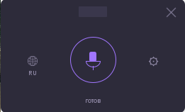

# 🎙️ Voice Typer 2

## 📋 Описание
Voice Typer 2 – легковесный, полностью локальный и приватный ассистент голосового ввода для **Windows** (поддерживается Linux).
Написан на Kotlin, использует `whisper.cpp` через CLI, записывает речь по удержанию горячей клавиши, распознаёт её без отправки в интернет и автоматически вставляет готовый текст в любое активное поле ввода.



## ✨ Возможности

| Что                                                | Как работает |
|----------------------------------------------------|--------------|
| **Push‑to‑Talk** (F9)                              | Удерживайте F9 → запись. Отпустите – транскрипция начинается, результат автоматически вставляется в активное поле. |
| **Глобальные хоткеи**                              | Работают во всех приложениях. Параметры можно изменить в `config.json`. |
| **Переключение языка** (F10)                       | RU/EN (по умолчанию “ru”). Язык автоматически определяет Whisper, но может быть явно задан. |
| **Скрыть/показать окно** (F8)                      | Быстро свернуть/развернуть плавающее окно без рамок. |
| **Кастомный UI**                                   | Плавающее окно без заголовка, можно перетаскивать мышью. Размер меняется в диалоге настроек. |
| **Системный трей**                                 | Иконка с индикатором записи + контекстное меню «О программе» / «Выход». |
| **Автоматическое выкачивание модели Whisper**      | При первом запуске приложение скачивает нужный `whisper-cli.exe` (32/64‑bit) из GitHub и распаковывает его в `resources/win`. |
| **Автоматическая загрузка моделей**                | Если нужная модель (`ggml-<size>.bin`) отсутствует, она загружается с HuggingFace. |
| **Логирование**                                    | Все события сохраняются в `logs/voicetyper.log` (таймстамп + уровень). |
| **Кроссплатформенность**                           | Работает под Windows и Linux (папка `resources/ubuntu`). |

## 🛠️ Установка

### Требования
1. **Java 17+** (JDK)
2. *Никакой дополнительный* Whisper‑бинарник – приложение сам скачает его.

### Запуск
```bash
# Сборка проекта
./gradlew build

# Запуск
./gradlew run
```
Или через IDE (IntelliJ IDEA):
- Откройте проект
- Нажмите **Run** (Shift+F10)

> При первом запуске приложение автоматически извлечёт/скачает `whisper-cli.exe` и нужные модели.

## ⌨️ Горячие клавиши
| Клавиша | Действие |
|---------|----------|
| **F9** – удержание | Начать запись. Отпустить → обработка и вставка |
| **F10** | Переключить язык (RU/EN) |
| **F8** | Показать / скрыть окно |

> Горячие клавиши можно изменить в `config.json` (`show_window_hotkey`, `record_key`, `lang_toggle_hotkey`).

## ⚙️ Конфигурация
Файл настроек находится по пути:
`%USERPROFILE%\.config\voice-typer\config.json`
```json
{
  "show_window_hotkey": "f8",
  "record_key": "f9",
  "lang_toggle_hotkey": "f10",
  "sample_rate": 16000,
  "channels": 1,
  "model_size": "base",
  "device": "auto",
  "beam_size": 5,
  "language": "ru",
  "app_language": "ru",
  "window_size": "260x160"
}
```
Параметры:
- `model_size` – "tiny", "small", "medium" или "base" (по умолчанию `base`).
- `window_size` – размеры окна (`260x160`, `340x200`, `420x240`).
- `language` – язык транскрипции, можно менять в диалоге настроек.

## 📁 Структура проекта
```
src/main/kotlin/com/voicetyper/
├── AppConfig.kt           # Модель конфигурации
├── TranscriptionResult.kt # Результат транскрипции
├── ConfigManager.kt       # Загрузка / сохранение конфига
├── Locales.kt             # Локализация (RU/EN)
├── Logger.kt              # Логирование в logs/voicetyper.log
├── AudioRecorder.kt       # Запись с микрофона
├── WavFileWriter.kt       # Запись PCM в WAV
├── WhisperEngine.kt       # Вызов whisper-cli.exe и парсинг JSON
├── HotkeyListener.kt      # Глобальные хоткеи через JNA
├── TrayIconManager.kt     # Трей‑иконка + меню
├── ClipboardManager.kt    # Вставка текста в активное поле
├── UiCanvas.kt            # Кастомный UI (плавающее окно)
├── AppProcessor.kt        # Центральный контроллер
└── Main.kt                # Точка входа приложения
```

## 📄 Лицензия
MIT License
